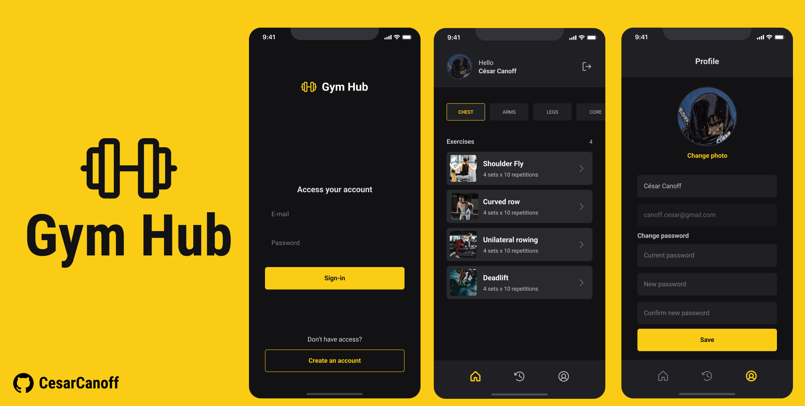

 <br />
  <br />

  <p>
    This app was created with the main aim of offering a learning opportunity in mobile app development using React Native and TypeScript technology. I developed this project as a starting point for exploring the fundamental concepts and best practices of developing on one of the most popular platforms for creating mobile apps, studying Native Base and Bottom Tabs Navigation.
  </p>

  ---

  <h3>📚 Technologies</h3>

  
  
  
  
  
  

  ---

  ### Installation Guide (Linux and Windows)

  #### Prerequisites
  
  - Before you begin, ensure you have the following prerequisites installed:
  - Node.js and npm: You can download and install them from the official Node.js website: Node.js
  - Expo CLI: Install Expo CLI globally using npm:
  ```bash
  npm install -g expo-cli
  ```

  1. Clone the repository:
  Open your terminal (Command Prompt for Windows) and execute the following command to clone the Event-Go repository:
  ```bash
  git clone https://github.com/CesarCanoff/gymhub.git
  ```

  2. Navigate to the app directory:
  Change to the Gym Hub directory that you just cloned:
  ```bash
  git clone https://github.com/CesarCanoff/gymhub.git
  ```

  3. Install dependencies:
  Use npm to install all the app's dependencies. This may take some time depending on the project's size:
  ```bash
  npm install
  ```
  4. Start the app with Expo:
  After the dependencies are successfully installed, you can start the Gym Hub using Expo Go. Run the following command:
  ```bash
  npx expo start
  ```

  5. Run on Emulator (Linux):
  If you're using Linux and want to run the app on an Android emulator, make sure you have an
  Android emulator like Android Studio's AVD Manager set up. Then, in the Expo DevTools that open in your browser, press "a" to run the app on the Android emulator.

  6. Run on Emulator (Windows):
  If you're using Windows and want to run the app on an Android emulator, ensure you have an Android emulator like Android Studio's AVD Manager
  configured. In the Expo DevTools that open in your terminal, press "a" to run the app on the Android emulator.

  7. Access the app on your device (iOS/Android):
  Scan the QR code displayed in the Expo DevTools with your Expo Go app on your iOS or Android device. Alternatively, you can use the Expo Go app to open the project by entering the provided URL.

  You should now have the Gym Hub installed and running using Expo Go on your Linux or Windows system.
  Enjoy using Event-Go! If you need further assistance or encounter any issues, refer to the project's documentation or reach out to the developer.
